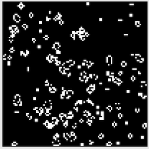
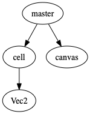

# Cell Automaton 2020
- ライフゲームと呼ばれる種類のセルオートマトンを実装した。

## 実装
- prototypeを使って、メソッドを追加した。
- cellの１つ１つをオブジェクトにすることで、動作は重くなるものの、コードの見通しが良くなった。
    - 重いといっても100*100objで30fpsなら余裕で動く。

## to do
- 一時停止機能、ドローイング機能を付けたい
    - buttonの実装
    - クリックの認識

### オブジェクトの構造
